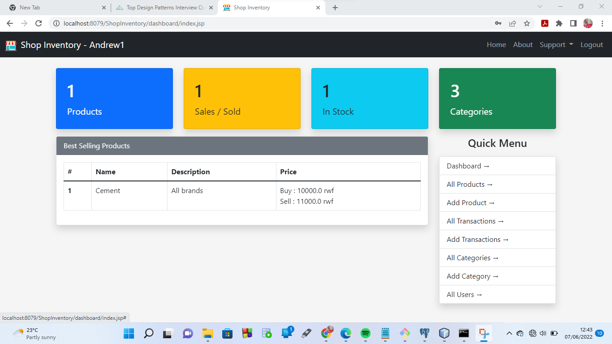

# Shop Inventory

A simple projects that keeps track of a shop's inventory (stock). Best programming school project, written in Java...

## Requirements

- Web browser: Chrome, or Firefox...
- IDE: Netbeans
- Database: Mysql, or Postgres...

## Installation

- git clone `https://github.com/andrewkwizera/shop-inventory`
- Open netbeans, and import project (from where it was cloned)
- Configure `src/java/hibernate.cfg` to match your database configurations
- Run the project

### Contributors

- Kwizera Andrew
- Mayala Serge
- Ndikumwenayo Josue
- Ishimwe Kelly Kesia
- Aime Nduwayesu
- Ngoga Alexis
- Mugemana Ghislain

### Tasks, Checklist

- [x] Database structure
- [x] GUI design, layout
- [x] CRUD operations
- [ ] Apply best practices
  - [x] Principles; SOLID, DRY, KISS
  - [ ] Testing; unit, performance
